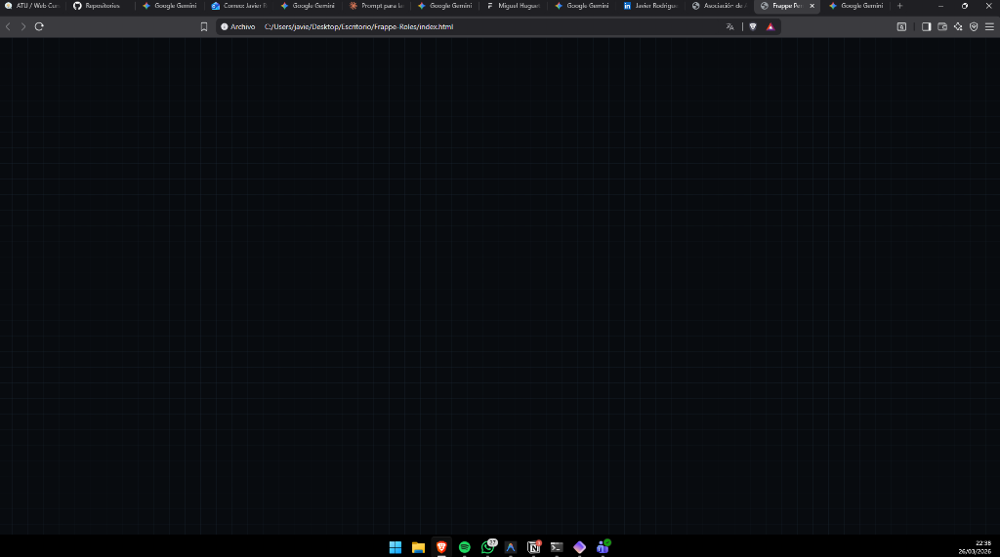

<p align="center">
  
</p>

<h1 align="center">🛡️ Frappe Permission Auditor</h1>

<p align="center">
  <strong>Enterprise-grade security auditing suite for Frappe/ERPNext</strong><br/>
  A zero-dependency, single-file SPA that connects to any Frappe instance via REST API to audit, manage, and visualize user permissions in real time.
</p>

<p align="center">
  
  
  
  
  
</p>

---

## 📸 Screenshots

### Authentication Screen


### Dashboard — Connected


---

## 🎯 Why This Exists

Frappe/ERPNext administrators face a common, painful problem: **there is no native tool to visualize, audit, or bulk-manage user permissions**. You're forced to check roles one-by-one, manually cross-reference DocPerms in the console, and hope nothing slips through the cracks.

**Frappe Permission Auditor** solves this by providing a comprehensive, visual security dashboard that connects to any Frappe instance in seconds.

---

## ✨ Features

### 🔍 9 Powerful Audit Modes

| Mode | Description |
|------|-------------|
| **Role Mode** | Select any role and instantly see every DocType it can access, with a full permission matrix (read, write, create, delete, submit, cancel, amend, report, export, import, share, print, email) |
| **User Mode** | Analyze a specific user's effective permissions — aggregated across all their assigned roles. Detects System Manager superadmin status |
| **DocType Mode** | Inspect any DocType to see which roles have access, plus a built-in **permission simulator** ("Can user X do action Y on DocType Z?") |
| **Risk Audit** | Automated security scanner that detects: redundant administrators, users with delete access to sensitive DocTypes (Sales Invoice, Journal Entry, etc.), duplicate roles, and User Permission rules |
| **User Comparer** | Side-by-side comparison of two users' roles and permissions with visual diff highlighting |
| **Reverse Matrix** | Select a role and see every user assigned to it — the inverse of User Mode |
| **Role Management** | Assign or remove roles from users directly. Includes **Bulk Mode (BETA)** for mass operations across multiple users |
| **Timeline** | Forensic audit trail showing every role change for a user, with timestamps, who made the change, and **out-of-hours alerts** for suspicious activity |
| **Executive Report** | Security health score (0-100), Chart.js visualization of role distribution, top over-permissioned users, most permissive DocTypes, and ghost roles |

### 🔐 Security Features

- **Automated Risk Detection**: Flags users with both `Administrator` and `System Manager` roles
- **Sensitive DocType Monitoring**: Alerts on delete permissions for critical documents (Sales Invoice, Journal Entry, Payment Entry, Bank Account, Salary Slip, etc.)
- **Duplicate Role Detection**: Identifies roles with identical permission sets that can be merged
- **Out-of-Hours Alerts**: Flags role changes made outside business hours (weekends, after 8 PM)
- **Security Health Score**: Algorithmic scoring that penalizes excessive admin accounts, mass delete permissions, and ghost roles

### 📊 Export & Reporting

- **CSV Export**: Available across all audit modes for spreadsheet analysis
- **JSON Export**: Full executive report data export
- **Clipboard Copy**: One-click summary copy for executive reports and emails

### 💾 Quality of Life

- **Credential Persistence**: Save your API credentials in `localStorage` — no need to re-enter them every session
- **Auto-Connect**: If credentials are saved, the app connects automatically on load
- **CORS Proxy Support**: Built-in toggle for local CORS proxy (included `proxy.js`)
- **Real-time Loading Indicators**: Shimmer animations and progress overlays for all operations

---

## 🚀 Quick Start

### Prerequisites

- A running **Frappe/ERPNext** instance (v13+)
- API credentials (API Key + API Secret)

### Getting API Credentials

1. Log into your Frappe/ERPNext instance
2. Go to your **User Profile**
3. Navigate to **Settings > API Access > Generate Keys**
4. Copy the **API Key** and **API Secret**

### Option 1: Direct File (Simplest)

```bash
# Just open the file in your browser
open index.html
```

> ⚠️ If you encounter CORS errors, use Option 2.

### Option 2: With CORS Proxy (Recommended)

```bash
# Install dependencies for the proxy
npm install cors-anywhere

# Start the CORS proxy
node proxy.js

# Now open index.html and enable the "CORS Proxy" checkbox
```

### Option 3: Local HTTP Server

```bash
# Python
python -m http.server 8000

# Then navigate to http://localhost:8000
```

---

## 🏗️ Architecture

```
Frappe-Permissions/
├── index.html          # Complete SPA (React 18 + Tailwind CSS + Chart.js)
├── proxy.js            # CORS-anywhere proxy server for local development
├── start_auditor.bat   # Windows batch file to start the proxy
├── screenshots/        # Application screenshots
│   ├── login.png
│   └── dashboard.webp
├── LICENSE             # MIT License
└── README.md           # This file
```

### Tech Stack

| Technology | Purpose |
|-----------|---------|
| **React 18** | UI Components (via CDN, no build step) |
| **Tailwind CSS** | Utility-first styling (via CDN) |
| **Chart.js** | Data visualization in Executive Report |
| **Babel Standalone** | In-browser JSX compilation |
| **Frappe REST API** | Data source for all audit operations |

### Design Decisions

- **Single-file architecture**: No build tools, no npm install, no configuration. Just open `index.html` and go
- **Zero backend**: Everything runs client-side. Your API credentials never leave your browser
- **Dark-first design**: Premium dark theme with custom color palette optimized for extended audit sessions
- **Defensive API calls**: URI encoding for DocTypes with spaces, graceful error handling, and retry-friendly architecture

---

## 🔧 Configuration

### CORS Proxy (`proxy.js`)

The included proxy runs on port `8080` by default. To change it:

```javascript
// In proxy.js, modify the port
const PORT = 8080; // Change this
```

### Sensitive DocTypes

The risk audit scans these DocTypes by default. You can modify the `SENSITIVE_DOCTYPES` array in `index.html`:

```javascript
const SENSITIVE_DOCTYPES = [
    "Sales Invoice", "Journal Entry", "Payment Entry",
    "User", "Role", "DocPerm", "Bank Account",
    "Salary Slip", "Employee", "Customer", "Supplier"
];
```

---

## 🤝 Contributing

Contributions are welcome! Some ideas for future improvements:

- [ ] **Undo/Rollback** for bulk role operations
- [ ] **Permission Level** (`permlevel`) support
- [ ] **Pagination** for very large Frappe instances (10k+ users)
- [ ] **Dark/Light mode toggle**
- [ ] **Role templates** for common permission patterns
- [ ] **Scheduled audits** with email reports

---

## 📄 License

This project is licensed under the **MIT License** — see the [LICENSE](LICENSE) file for details.

---

## 👨‍💻 Author

**Javier — Grupo ATU Internal Tools**

Built to solve real-world Frappe/ERPNext administration challenges.

---

<p align="center">
  <sub>Made with ☕ and frustration from manually auditing Frappe permissions</sub>
</p>
